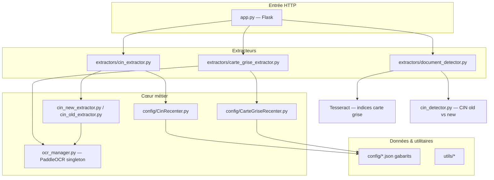
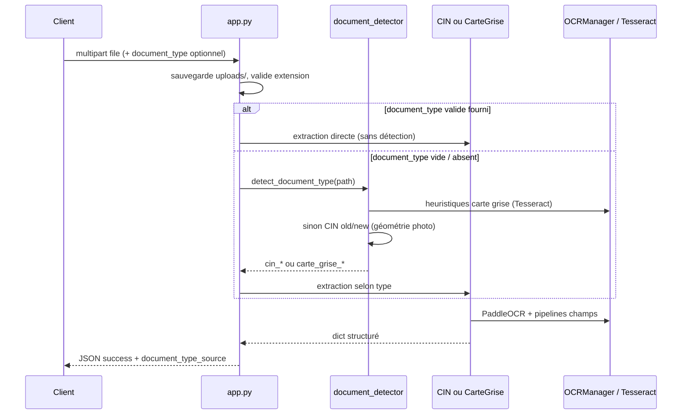
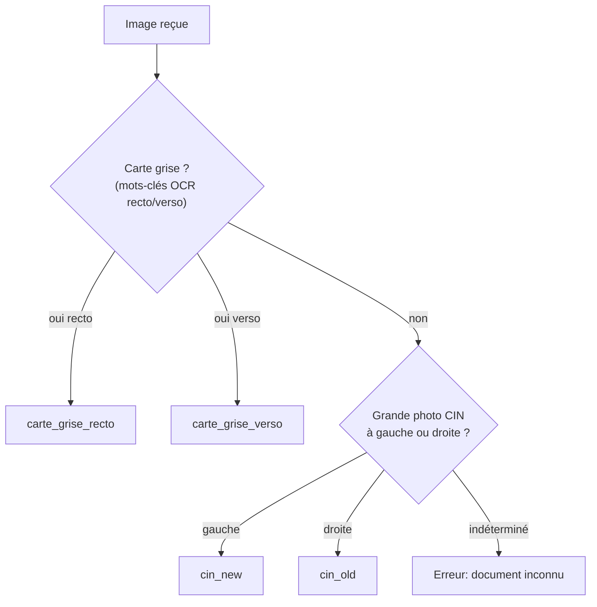
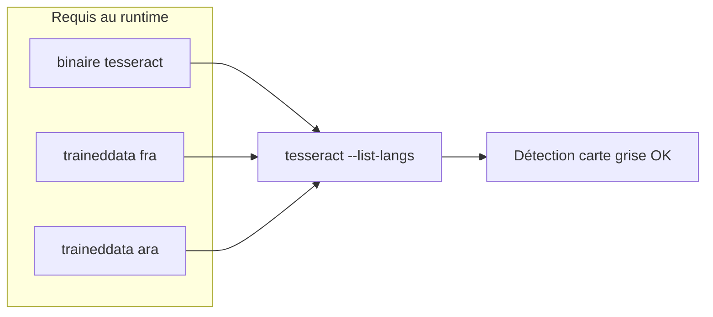

# Architecture — OCR Extracter

Vue d’ensemble du dépôt et du flux d’une requête d’extraction.

## Structure des dossiers (logique)

## Flux d’une requête `POST /extract`

## Décision automatique du type de document

Ordre implémenté dans `extractors/document_detector.py` : **carte grise d’abord**, puis **CIN** (via `cin_detector.py`).

## Composants clés

| Fichier / module | Rôle |
|------------------|------|
| `app.py` | Routes, upload, choix auto vs `document_type` client, orchestration extracteurs |
| `ocr_manager.py` | Instance unique PaddleOCR `ar` + `fr`, pool de threads, warmup |
| `extractors/document_detector.py` | Détection auto (Tesseract + règles mots-clés, fallback) |
| `cin_detector.py` | Distinction CIN ancien / nouveau selon la position de la photo |
| `extractors/cin_extractor.py` | Branche vers alignement ORB + extracteurs CIN |
| `extractors/carte_grise_extractor.py` | Alignement carte grise, champs, Tesseract/Paddle selon zones |
| `config/*.json` | Gabarits de zones / métadonnées document |

## Dépendances Python (résumé)

- **Flask / Werkzeug** : API HTTP  
- **OpenCV, NumPy, Pillow** : images et géométrie  
- **pytesseract** : OCR léger pour la **détection** (carte grise)  
- **paddlepaddle / paddleocr** : OCR principal à l’**extraction**  
- **requests** : `test_api.py`  
- **easyocr** : scripts outils sous `config/` et `utils/ocr_utils.py` (génération de templates)

Le détail des versions est dans `requirements.txt`.

## Prérequis système : Tesseract (fra + ara)

Le module `extractors/document_detector.py` appelle Tesseract avec **`lang="fra+ara"`**. Il faut donc les **données de langue** Tesseract pour le **français** (`fra`) et l’**arabe** (`ara`), pas seulement le binaire.

- **Linux / macOS** : `start.sh` peut installer **en CLI** le moteur et, si besoin, les paquets **fra/ara** (`AUTO_INSTALL_TESSERACT_LANGS=1` ou invite interactive).  
- **Windows** : pas d’installation auto des langues dans le script ; l’installateur graphique doit inclure **French** et **Arabic** ; `start.ps1` vérifie `tesseract --list-langs` avant de lancer l’API.

Détails et commandes manuelles : [`README.md`](README.md) (section Tesseract).
